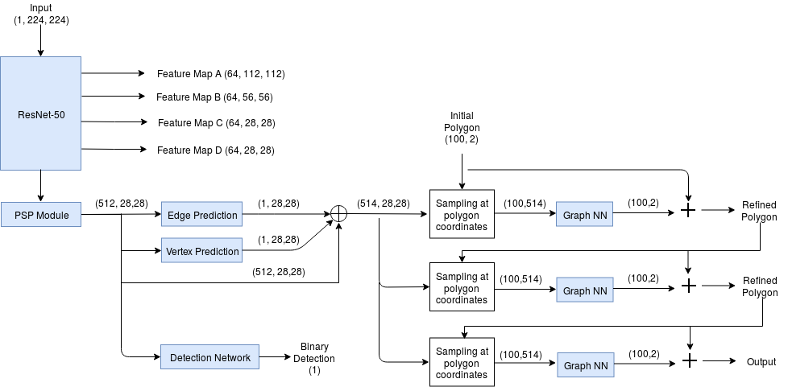
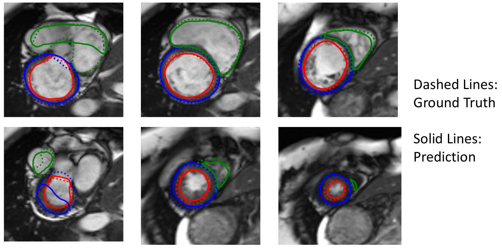

# Curve-GCN for Cardiac MRI Segmentation

These are some preliminary results on applying Curve-GCN
(<https://arxiv.org/abs/1903.06874>) to the problem of cardiac
MRI segmentation.

Unlike commonly used neural networks for image segmentation (FCN, U-net),
Curve-GCN predicts contour points around an object's boundary similar
to how humans annotate images.

For this specific application, I extended the network to perform
segmentation of upto 3 objects: left ventricle (LV), myocardium (Myo)
and right ventricle (RV). Also, since some images only have 1 or 2 of these
structures, I added an additional head to classify whether the image
contains each structure or not.

A diagram of the network architecture is shown below.

I used the polygon loss for predicting the contour loss and a binary
cross-entropy loss for the additional classification branch.

## Results
Representative results are shown below. While the LV segmentation performance
is comparable to U-net performance, Myo and RV segmentation performance
are worse than the U-net.

## Interesting Points
- There is a jump from image or feature maps to coordinates. Using
something like CoordConv (<https://arxiv.org/abs/1807.03247>)
might help.

- We are only using a small fraction of pixels in each image/feature map.

## Improving Curve-GCN Results
- Add constraints on curvature of polygon
- Add IOU/Dice loss

- Add domain specific knowledge:
    - Red contour must be inside blue contour
    - Green contour shares border with blue contour on most slices

- Sampling and GNN are not equivariant to translation
- More data

### Note
Note that due to the original Curve-GCN code's license, a lot of the code was
redacted here. Please send me an email at <matthewng.ng@mail.utoronto.ca> if
you would like to learn more about this project.
